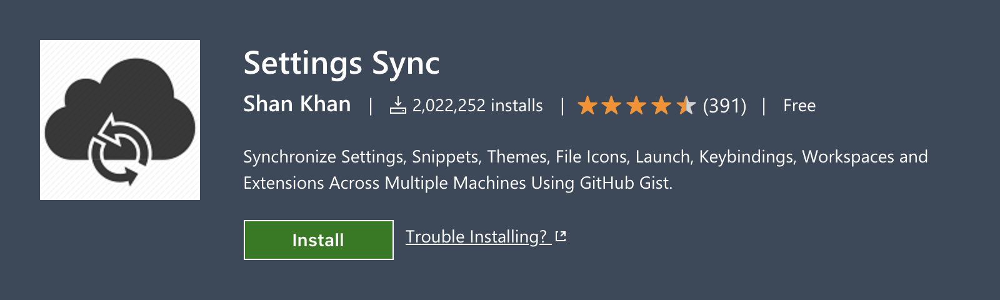
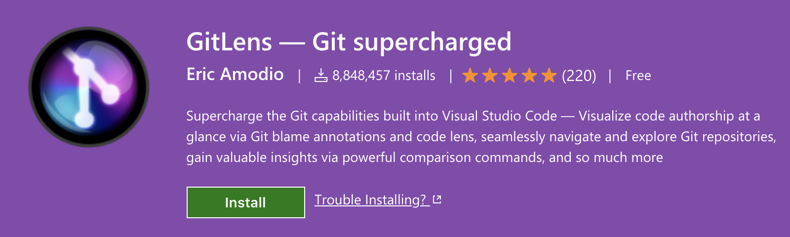

# Visual Studio **Code**

tags: vscode, javascript, python, git, extensions

For sure, this is the most used tool in my daily work, so is good to have a guide of extensions that would make my work easy.

I've chosen **VS code** as my code editor because it's faster than **Atom** and offer a lot of extensions. Also it has features to create workspaces, manage git easily and a good API to create your own extensions.

## General extensions

So, let's talk about extensions. When I have a fresh installed vscode, the first extension to be installer is [**Settings Sync**](https://marketplace.visualstudio.com/items?itemName=Shan.code-settings-sync)

Access its page, read the instructions, set a private gist, give access to it and **it's done**. You'll have all your settings shared between installs. You can also use the same gist to differents installs, but one vscode can overwrite the seetings made by other, so be very careful.

If I've a previous settings backup, this is the first and last step! 😎

Other amazing tool that I really like is [`git`](./git.md). Vscode cames with git management out of the box, but I like a little more control about my *history*, *logs*, remote and local *branchs*, *tags*, *git blame* and so on... Because of that I use a lot [**Gitlens**](https://marketplace.visualstudio.com/items?itemName=eamodio.gitlens)

It also adds an icon below extensions to get fult access to git.